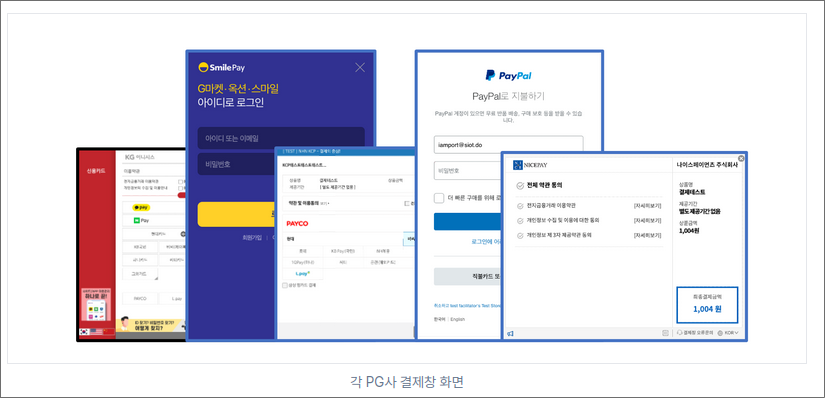
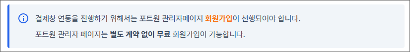
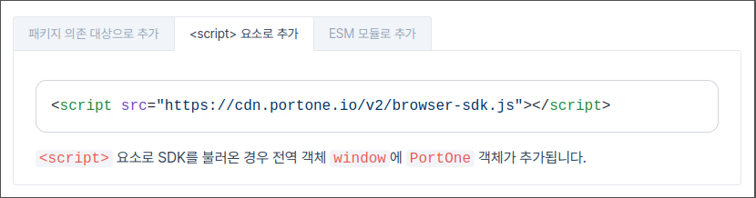
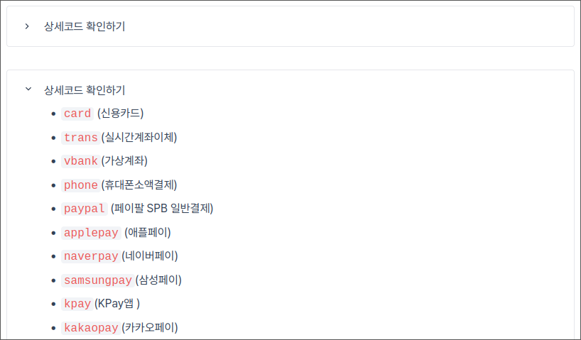
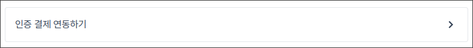

# 문서 작성 가이드

개발자센터의 문서는 [Markdown]() 문법의 확장인 [MDX](https://mdxjs.com/) 형식으로 작성되어 있습니다.\
`src/routes/(root)/docs/[lang]/[...slug].mdx` 경로의 파일을 열어서 수정해주시면 됩니다.\
`src/routes/(root)/docs/[lang]/_nav.yaml` 파일을 열어서 좌측 네비게이션 메뉴 항목을 수정할 수 있습니다.

## 에디터 환경 구성하기

개발자센터의 문서는 ESLint와 Prettier, remark-lint를 통해 포매팅과 린팅이 이뤄집니다.
[각 툴에 맞는 VSCode 확장](./.vscode/extensions.json)이 저장소에 설정돼있으니
가급적 VSCode에서 저장소 추천 에디터 확장을 전부 설치하고 문서 수정을 부탁드립니다.

## 컴포넌트 활용하기

개발자센터에서는 편리한 문서 작성을 위해 다양한 컴포넌트들을 사용할 수 있습니다.

### `<Figure>`



테두리가 씌워진 이미지를 그리는 컴포넌트입니다. 선택적으로 캡션 텍스트를 추가할 수 있습니다.

```tsx
import Figure from "~/components/Figure";

import image from "./_assets/image.png";

<Figure
  src={image}
  caption="이미지" // 생략 가능
  width="300" // 생략 가능, 생략 권장
/>;
```

### `<Hint>`



유의사항 등을 표현하기 위한 컴포넌트입니다.

```tsx
import Hint from "~/components/Hint";

// style은 info, warning, success, danger를 지원합니다.
<Hint style="info">Hint 컴포넌트는 이와 같이 활용합니다.</Hint>;
```

### `<Tabs>` & `<Tab>`



탭 형태로 여러 컨텐츠를 정돈해서 표시하기 위한 컴포넌트입니다.

```tsx
import Tabs from "~/components/gitbook/tabs/Tabs";

<Tabs>
  <Tabs.Tab title="1번 탭">1번 탭의 본문입니다.</Tabs.Tab>
  <Tabs.Tab title="2번 탭">2번 탭의 본문입니다.</Tabs.Tab>
  <Tabs.Tab title="3번 탭">3번 탭의 본문입니다.</Tabs.Tab>
</Tabs>;
```

### `<Details>`



접고 펼 수 있는 형태로 컨텐츠를 정돈해서 표시하기 위한 컴포넌트입니다.

```tsx
import Details from "~/components/gitbook/Details";

// <Fragment> 외에 <p>나 다른 컴포넌트를 활용할 수도 있습니다.
<Details>
  <Details.Summary>접혀 있을 때 보일 내용</Details.Summary>

  <Details.Content>
    펼쳐졌을 때 보여질 내용
  </Details.Content>
</Details>;
```

### `<VersionGate>`

최상단의 V1/V2 토글 상태에 따라 다른 컨텐츠를 표시하기 위한 컴포넌트입니다.

```tsx
import VersionGate from "~/components/gitbook/VersionGate";

<VersionGate v="v1">
  V1에서 보여질 내용
</VersionGate>

<VersionGate v="v2">
  V2에서 보여질 내용
</VersionGate>
```

### `<ContentRef>`



문서 내에서 타 문서에 대한 블록 스타일의 링크를 간편하게 삽입하기 위한 컴포넌트입니다.

```tsx
import ContentRef from "~/components/gitbook/ContentRef";

// 컴포넌트 내에서 페이지 이름을 자동으로 불러와 표시합니다.
<ContentRef slug="/opi/ko/ready/readme" />;
```

### 문서화되지 않은 컴포넌트들

`<Parameter>`, `<Youtube>`, `<Swagger>` 등
이 문서에 설명되지 않은 컴포넌트들은 다양한 이유로 인해 사용이 권장되지 않습니다.
(레거시 컴포넌트, 테스트 중인 컴포넌트, ...)
포트원 크루이실 경우 사용(기존 코드 복사 포함)을 원하실 때
슬랙의 `#chapter-dx` 채널에서 문의해 주시기 바라며,
외부 기여자이실 경우 위 컴포넌트들을 활용하는 대신 직접 코드를 작성해 주시길 바랍니다.

## 문서 작성 규칙

### 시맨틱한 마크다운 작성하기

마크다운과 MDX는 HTML 형태로 출력되는, 고유의 시맨틱을 가진 언어입니다.
각 마크다운 문법의 시맨틱을 준수해서 문서를 작성해주세요.

- **Unordered List(`-`) 남용하지 않기**

  UL 문법은 가급적이면 항목이 여러 개인 경우에 대해서만 사용하시는 것을 권장 드립니다.

- **Unordered(`-`)/Ordered(`1.`, `2.`, ...) List 상황에 맞게 사용하기**

  순서가 명확한 목록 컨텐츠를 작성할 경우에는 Ordered를, 이외의 경우에는 Unordered를 사용해주세요.

- **Blockquote(`>`)를 시각적 효과를 위해 사용하지 않기**

  Blockquote 문법은 인용구를 위한 문법으로 용도가 철저히 제한되는 문법입니다.
  시각적 효과는 HTML + CSS를 통해서 구현해주세요.

### 이미지는 `import`해서 사용하기

개발자센터에는 `import`를 통해 가져온 이미지를 압축 및 최적화하는 절차가 세팅되어 있습니다.
이 절차는 이미지를 `` 등의 방식으로 경로를 지정하여
가져오는 경우에는 적용되지 않는데, 이 경우 페이지의 성능 및 데이터 사용량 등이 크게 저하되니
가급적이면 `import`를 대신 사용해 주시기 바랍니다.
이때 이미지 파일은 해당 MDX 파일이 속한 폴더에 `_assets` 폴더를 생성하여,
적절한 이름과 함께 추가하시는 것을 권장합니다.

```tsx
// 1. <Figure> 컴포넌트 사용하기 (권장)
import Figure from "~/components/Figure";

import logo from "./_assets/tosspayments-logo.png";

<Figure src={logo} caption="토스페이먼츠 로고" />;

// 2. <Picture> 컴포넌트 직접 사용하기
import Picture from "~/components/Picture";

import logo from "./_assets/tosspayments-logo.png";

<Picture picture={logo} alt="토스페이먼츠 로고" />;
```

### 코드 블럭에 올바른 언어 이름 사용하기

개발자센터의 마크다운 코드 블럭은 [Prettier][]에 의해 포매팅되며,
[Shiki][]에 의해 하이라이팅됩니다. 가급적이면 두 툴링을 모두 지원하는 언어를 사용하여
코드 블럭을 작성해 주세요.

- [Prettier에서 지원되는 언어 확인하기](https://prettier.io/docs/en/)
- [Shiki에서 지원되는 언어 목록](https://shiki.matsu.io/languages)

Prettier의 경우 플러그인을 통해 언어 지원을 추가할 수 있으니,
만약 사용하시려는 언어에 대한 플러그인을 추가하기 원하신다면
슬랙의 `#chapter-dx` 채널 또는 [GitHub Discussions][]를 통해 문의해 주세요.

사용하시는 언어가 Prettier에 의해 지원됨에도 정상적으로 포매팅이 이뤄지지 않을 경우,
다음을 의심해볼 수 있습니다.

- 문법 오류가 있어 정상적으로 포매팅이 이뤄지지 않고 있을 수 있습니다.
  문법 오류를 수정해주세요.
- `eslint-plugin-mdx`가 언어 이름을 정상적으로 파싱하지 못할 수 있습니다.
  슬랙의 `#chapter-dx` 채널 또는 [GitHub Discussions][]를 통해 문의해 주세요.

[Prettier]: https://prettier.io
[Shiki]: https://shiki.matsu.io

### 중복된 내용의 문서 작성 최소화하기

- **V1/V2 문서 분리 대신 `<VersionGate>` 사용하기**

  V1/V2에 따라 다른 컨텐츠를 보여주고 싶으신 경우, 대부분의 내용이 동일한
  새로운 문서를 생성하기보다는 `<VersionGate>` 컴포넌트를 활용하여 버전별로 보여질
  컨텐츠의 내용을 나눠 주세요.

- **중복/공통된 내용 컴포넌트화하기**

  문서를 작성하다 보면 중복/공통된 내용을 여러 번 작성하게 되는 경우가 있습니다.
  이 경우 중복/공통된 내용을 별도의 MDX 파일로 분리하여 작성한 후,
  해당 내용을 사용할 파일에서 위 파일을 `import`해서 컴포넌트 형태로 활용해주세요.

  - **예시**

    V1에서는 토스페이먼츠 구모듈/신모듈별 정보를 모두 보여 주고,
    V2에서는 신모듈에 대한 정보만 보여 줘야 하는 요구사항이 있을 때,
    신모듈에 대한 정보를 [별도 컴포넌트로 분리][componentify-define]하고,
    [해당 컴포넌트를 `import`][componentify-import]해서,
    [여러 번 사용하는 방식][componentify-usage]으로
    중복 내용의 작성을 막을 수 있습니다.

    [componentify-define]: https://github.com/portone-io/developers.portone.io/blob/1e622773eaf8b7a65bb69fa6de10d80dbaddc970/src/routes/(root)/docs/ko/ready/_components/integration-guide/tosspayments.mdx
    [componentify-import]: https://github.com/portone-io/developers.portone.io/blob/1e622773eaf8b7a65bb69fa6de10d80dbaddc970/src/routes/(root)/docs/ko/ready/readme.mdx?plain=1#L50
    [componentify-usage]: https://github.com/portone-io/developers.portone.io/blob/1e622773eaf8b7a65bb69fa6de10d80dbaddc970/src/routes/(root)/docs/ko/ready/readme.mdx?plain=1#L324

### 기존 문서 제거 시 리다이렉션 설정하기

개발자센터에 대한 죽은 링크가 생기는 것을 방지하기 위해, 기존 문서가 제거되는 경우나
URL이 변경되는 경우 `src/routes/(root)/_redir.yaml` 파일에서
구-신 주소 간에 리다이렉션을 설정해야 합니다.

- 단순 URL 변경의 경우 파일 내에 적절히 새 리다이렉션 설정을 추가해주세요.
- 기존에 잘게 나누어져 있던 페이지를 단일 페이지로 합치는 경우,
  [URI Fragment][]를 사용하여 구 페이지로의 링크가 새 페이지 내의
  특정 섹션으로 이동할 수 있도록 설정해 주세요.

  [URI Fragment]: https://en.wikipedia.org/wiki/URI_fragment

- V1/V2로 나뉘어져 있던 페이지를 통합하시는 경우, 버전별 기존 URL이 연결될
  새 URL의 `?v=` 쿼리 파라미터가 각각 올바른 버전을 가리킬 수 있도록 설정해 주세요.
- 기존 페이지를 삭제하시려는 경우, 파일 자체를 삭제하시는 대신 먼저 좌측 내비게이션 메뉴
  항목에서 제거해 주시고, 페이지의 완전한 삭제는 `#chapter-dx`에서 논의 후 진행해주세요.

## 도움 받기

문서 작성에 도움이 필요하신 경우, 언제든지 편하게 도움을 요청해 주세요!

- 포트원 크루이신 경우, 슬랙의 `#chapter-dx`에서 질문해 주세요.
- 외부 기여자이신 경우, [GitHub Discussions][]에서 질문해 주세요.

[GitHub Discussions]: https://github.com/portone-io/developers.portone.io/discussions
